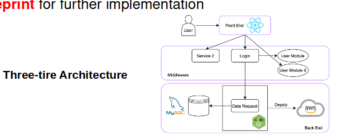

# Meeting Minutes

## Introduction

- Omar: python, java, bash, low-level programming
- Addison: python, some frontend
- Simon: java, python, DevOps (CI/CD)
- Shen: hates frontend, java, C, python
- Kai: hackathons, UX/UI design, python, java

## Structure of Team Meetings

- Meeting coordinator: Scheduling + Agenda Design + Leading Discussions
- Note-taker

## Project Topic

- CULater / C U Later
    - Planner for CUHK events and tasks with event/task sharing functionality
    - Main reasons for this decission: Predictable (no ML, no heavy UI design, no huge workload) + Specific to CUHK
- Core Functionalities
    - as a user I want to create tasks/events (title, description, date, location)
    - as a user I want to create/own groups, which other users can join (e.g. CUHK, SoftwareEngineering2025, ...)
    - as a user I want to be able to view my invites, and either accept or decline
    - as a user I want to assign tasks/events to different groups - everybody in the same group can see the tasks/events 
- Three-tier Architecture
    - Frontend: React
    - Middleware: Python
    - Backend: SQL

## Task Delegation

- simon: functional requirements (also user management, license management) & set up Trello
- kai: introduction
- addison: high-level system architecture 
- shen: assumptions and dependencies
- omar: support person and final formatting

Deadline: Send to Omar until Feb 4th

## Open Questions

- Is deployment part of the scope of the project?